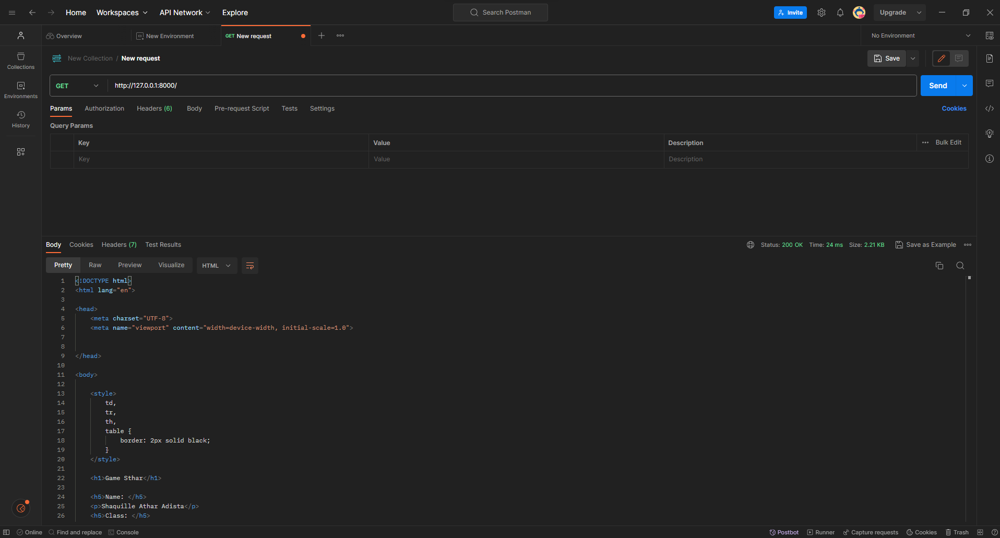
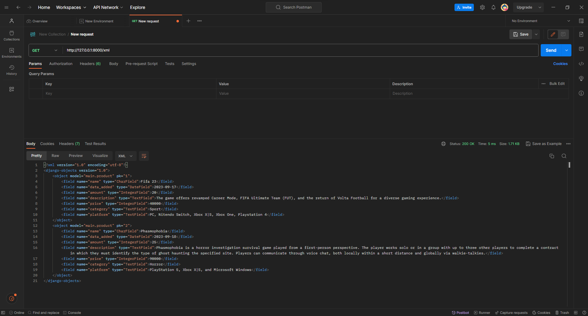
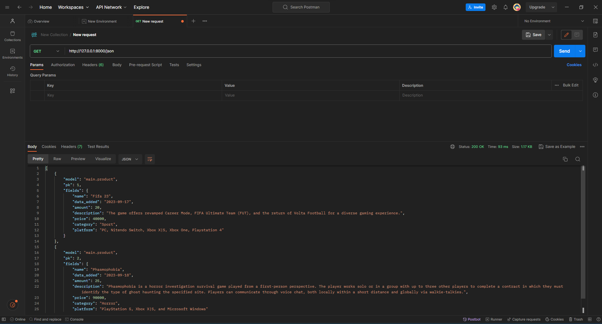
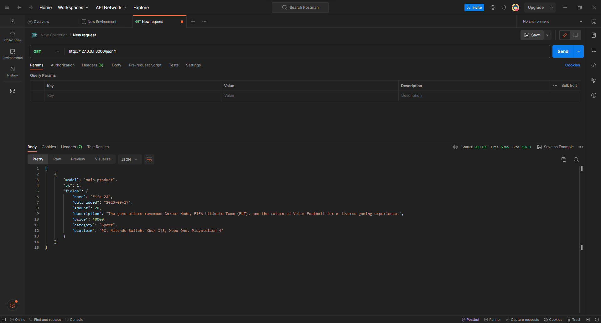
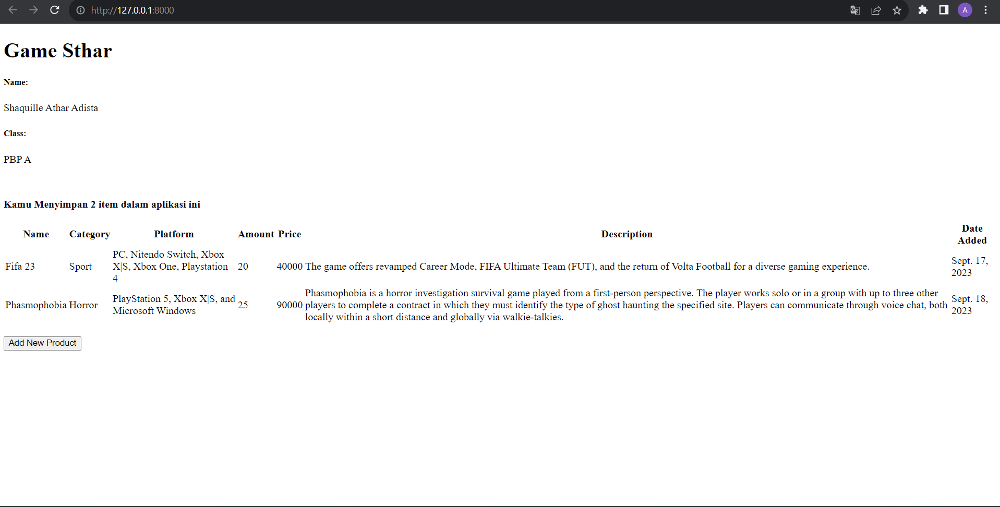
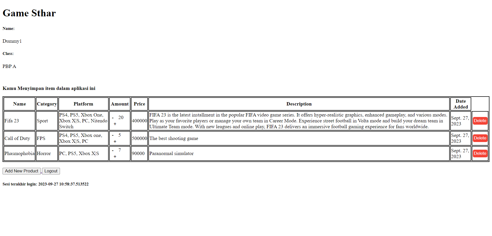
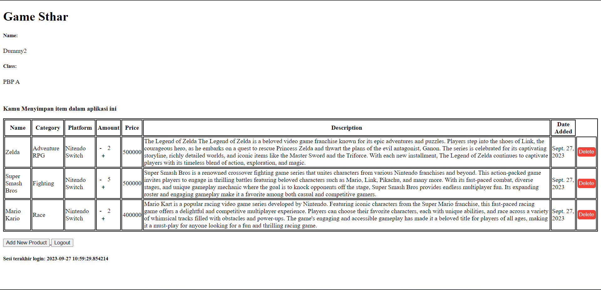

# PBP A

## GameSthar
### Nama : Shaquille Athar Adista
### NPM  : 2206081875
### Link : https://gamesthar.adaptable.app/main (Got Disabled :< )

---
## Tugas

<details>
  <summary> 
     WEEK 02
  </summary>

  ## 1. Jelaskan bagaimana cara kamu mengimplementasikan checklist di atas secara step-by-step (bukan hanya sekadar mengikuti tutorial). 

**Membuat sebuah proyek Django baru**

+ Buat direktori baru dengan nama `game_sthar`.
+ Terus, saya membuat _virtual environment_ dengan menjalankan perintah .

  ```
  python -m venv env
  ```
+ _virtual environment_ yang telah saya buat tadi berfungsi agar lingkungan kerja kita terisolasi sehingga __package__ serta __dependencies__ tidak akan bertabrakan dengan versi lain yang ada di komputer saya. Cara mengaktifkan __virtual environment__ adalah dengan menjalankan perintah.

  ```
  env\Scripts\activate.bat
  ```

Saya menggunakan perintah tersebut, karena saya menjalankannya di windows.

+ Selanjutnya saya membuat file `requirements.txt` di directory tadi, dan saya menambahkan beberapa __dependecies__ di dalamnya. Tujuannya adalah agar saya dapat menginstall __dependecies__ yang saya butuhkan di project ini.

  ```
  django
  gunicorn 
  whitenoise
  psycopg2-binary
  requests
  urllib3
  ```

+ Setelah itu, saya menjalankan perintah berikut untuk menginstall semua __dependecies__ yang ada di `requirements.txt`. Saya menginstall __dependecies__ ini di __virtual env__ yang telah saya buat tadi.

  ```
  pip install -r requirements.txt

  ```

+ Kemudian saya membuat project django yang bernama `game_sthar` dengan perintah berikut.

  ```
  django-admin startproject game_sthar .

  ```

+ Setelah terbentuk folder `game_sthar`, kemudian saya mencari file `settings.py` dan menambahkan `*` pada `ALLOWED_HOSTS`. Ini bertujuan agar kita mengizinkan akses dari semua host, yang akan membuat aplikasi dapat diakses secara luas.

+ Kemudian, saya menginisiasi direktori `game_sthar` sebagai repo github dengan cara `git init`.

+ Lalu, saya menambahkan `.gitignore` di dalam direktori tadi.


**Membuat aplikasi dengan nama `main` pada proyek tersebut**

+ Di proyek game sthar saya membuat aplikasi baru bernama `main` dengan cara menjalankan perintah berikut.
  ```
  python manage.py startapp main
  ```

+ Kemudian saya akan menambahkan aplikasi `main` ke dalam proyek game sthar dengan cara membuat berkas `setting.py` yang ada di dalam direktori `game_sthar`, kemudian pada `INSTALLED_APPS` saya akan menambahkan `main`.

+ Dalam direktori `main` saya membuat direktori baru yang bernama `templates` dan membuat file `main.html` di dalam direktori `templates`, Isi dari main dalah dilihat di [sini](https://github.com/AtharAdista/game-sthar/blob/main/main/templates/main.html)

**Melakukan routing pada proyek agar dapat menjalankan aplikasi main.**

+ Buka berkas `urls.py` yang ada di dalam direktori `game_sthar` lalu import fungsi `include` dari `django.urls` dan tambahkan rute URL untuk mengarahkan ke `main` di `urlpatterns`

  ```
  from django.contrib import admin
  from django.urls import path, include

  urlpatterns = [
      path('admin/', admin.site.urls),
      path('main/', include('main.urls')),
  ]
  ```

**Membuat model pada aplikasi main dengan nama Item dan memiliki atribut wajib.**

 + Saya membuat file `models.py` yang ada di direktori `main` untuk membuat model baru.
   - Saya mengisi file `models.py` sebagai berikut.
     ```
     from django.db import models
     class Product(models.Model):
        name = models.CharField(max_length=255)
        data_added = models.DateField(auto_now_add=True)
        amount = models.IntegerField()
        description = models.TextField()
        price = models.IntegerField()
        category = models.TextField()
        platform = models.TextField()

     ```
+ Kemudian saya melakukan perintah `makemigrations` untuk membuat migrasi model dan `migrate` untuk menerapkan migrasi ke dalam basis data.
  ```
  python manage.py makemigrations
  python manage.py migrate

  ```

**Membuat sebuah fungsi pada views.py untuk dikembalikan ke dalam sebuah template HTML yang menampilkan nama aplikasi serta nama dan kelas kamu.**

+ Buka file `views.py` yang ada di dalam folder `main`. kemudian tambahkan baris impor `from django.shortcuts import render`. 
+ Lalu tambahkan fungsi `show_main` seperti di bawah ini.

  ```
  from django.shortcuts import render

  def show_main(request):
      context = {
          'name' : 'Shaquille Athar Adista',
          'class' : 'PBP A',

      }

      return render(request, "main.html", context)
  ```

**Melakukan deployment ke Adaptable terhadap aplikasi yang sudah dibuat sehingga nantinya dapat diakses oleh teman-temanmu melalui Internet.**

+ Lakukan git add, commit, dan push sebelum mendeploy web kita.
+ Buka web **Adaptable** dan sign-in.
+ pilih `New App`. Pilih `Connect an Existiting Repository`. Lalu hubungkan semua repositori kita dengan Adaptable.io pada proses instalasi.
+ pilih repositori `game_sthar` dan pilih branch yang mau kita deploy.
+ pilih `python App Template`, kemudian pilih `PostgreSQL`.
+ pada bagian `version`, sesuaikan dengan versi python kita dan pada bagian `Start Command` masukkan perintah `python manage.py migrate && gunicorn game_sthar.wsgi`.
+ pilih nama domain yang kita mau dan centang bagian `HTTP Listener on PORT` dan deploy app.

 **BONUS**

 - Saya juga menambahkan unit test
  ```
  from django.test import TestCase, Client
  from .models import Product

  class mainTest(TestCase):
      def setUp(self):
          self.data= Product.objects.create(
              name = "Fifa 23",
              price = 40000,
              amount = 20,
              category = "Sport",
              platform = "PC, Nitendo Switch, Xbox X|S, Xbox One, Playstation 4",
              description = "The game offers revamped Career Mode, FIFA Ultimate Team (FUT), and the return of Volta Football for a diverse gaming experience.",

          ) 
    
      def test_product(self):
          self.assertEqual(self.data.name, "Fifa 23")
          self.assertEqual(self.data.price, 40000)
          self.assertEqual(self.data.amount, 20)
          self.assertEqual(self.data.category, "Sport")
          self.assertEqual(self.data.platform, "PC, Nitendo Switch, Xbox X|S, Xbox One, Playstation 4")
          self.assertEqual(self.data.description, "The game offers revamped Career Mode, FIFA Ultimate Team (FUT), and the return of Volta Football for a diverse gaming experience.") 

      def test_product_amount_not_negative(self):
          product = Product(name="Test Game", amount=10, price=100, category="Game", platform="PC", description="Test")
        
          self.assertTrue(product.amount >= 0)
    
      def setUp_web(self):
          self.client = Client()

      def test_template_elements(self):
          response = self.client.get('/main/') 

          self.assertEqual(response.status_code, 200) 

          self.assertContains(response, "<h1>Game Sthar</h1>")
          self.assertContains(response, "<h5>Name: </h5>")
          self.assertContains(response, "<h4>Game: </h4>")
          self.assertContains(response, "<h4>Amount: </h4>")
          self.assertContains(response, "<h4>Price: </h4>")
          self.assertContains(response, "<h4>Category: </h4>")
          self.assertContains(response, "<h4>Platform: </h4>")
          self.assertContains(response, "<h4>Description: </h4>")
   
          context = response.context  
          self.assertIn("name", context)
          self.assertIn("game", context)
          self.assertIn("amount", context)
          self.assertIn("price", context)
          self.assertIn("category", context)
          self.assertIn("platform", context)
          self.assertIn("description", context)

  ```

---
## 2. Buatlah bagan yang berisi request client ke web aplikasi berbasis Django beserta responnya dan jelaskan pada bagan tersebut kaitan antara urls.py, views.py, models.py, dan berkas html. 


 + User akan menuliskan sesuatu di browser.
 + Klien(browser) mengirim permintaan HTTP ke Django.
 + Django menerima permintaan dan menyampaikannya ke 
   `urls.py`.
 + `urls.py` akan mengarahkan request ke View sesuai url yang diterima.
 + View dapat berinteraksi dengan model yang merupakan komponen yang bertanggung jawab terhadap database.
 + Setelah mendapatkan data dari model, maka View akan merender Template HTML dan diisi dengan data yang sesuai.
 + View akan menghasilkan respons HTTP dan dikirimkan kembali ke klien.
 + Klien menerima respon dan menampilkan halaman web atau data yang diberikan.
 + Klien (browser) menampilkan halaman atau data kepada pengguna.

---
## 3. Jelaskan mengapa kita menggunakan virtual environment? Apakah kita tetap dapat membuat aplikasi web berbasis Django tanpa menggunakan virtual environment?

<p>Kita menggunakan virtual environment agar kita dapat memisahkan ruang kerja kita, jadinya kita dapat menggunakan versi python atau depedensi yang berbeda-beda antar virtual environment, dengan menggunakan virtual environment kita juga dapat menjaga kebersihan sistem kita, kita dapat menghindari potensi adanya masalah konflik depedensi dan kita juga dapat menciptakan proyek-proyek yang bersih dan terorganisir. Namun, kita juga tetap dapat membuat aplikasi web berbasis Django tanpa menggunakan virtual env, tetapi hal ini dapat mengakibatkan lingkungan kerja kita menjadi tidak terstruktur dan mungkin saja akan terdapat kesalahan dikarenakan perbedaan versi python atau dependensi di project-project kita.<p>

---
## 4. Jelaskan apakah itu MVC, MVT, MVVM dan perbedaan dari ketiganya.   

### MVC (Model View Controller) 

MVC adalah sebuah cara dalam membuat aplikasi atau website dengan memisahkan masing-masing bagiannya, yaitu database dalam model, tampilan dalam view, dan perintah-perintah yang memiliki fungsi dalam menghubungkan view dan model di controller. 
  - Model, merupakan komponen pertama dari MVC adalah model yang berfungsi untuk menyiapkan, mengorganisasikan, bahkan memanipulasikan data pada database.
  - View, merupakan bagian yang menampilkan desain tampilan dan juga informasi(data) kepada user atau pengguna (end user)
  - Controller, merupakan bagian yang menghubungkan model dan view pada setiap proses dan request dari user.  

  Dengan konsep model view controller, website sendiri terdiri dari masing-masing bagian yang terpisah sehingga memudahkan dalam mengembangkan dan pengerjaan. Proses pengerjaan aplikasi atau 
  website pun dapat dilakukan dengan cepat karena tim developer dapat lebih fokus ke salah satu bagiannya saja dari model, view, dan controller. Konsep MVC ini sudah diterapkan di berbagai framework PHP, Laravel, CodeIgniter, YII, Symfony, Yii, dan Zend.  

### MVT (Model View Template) 

MVT adalah sebuah pola desain arsitektur website yang terbagi menjadi tiga lapisan, yakni model, view, dan template. Konsep ini diyakini bisa mempercepat proses pembuatan website. Dengan konsep MVT ini, developer dapat mengorganisasi dan memisahkan komponen-komponen utama dalam aplikasi web. Berikut adalah penjelasan masing-masing bagian.
   - Model, merupakan bagian yang merepresentasi data dari aplikasi yang dibuat. Model adalah bagian yang berinteraksi dengan database dan  
     mengelola data aplikasi. Model mendefinisikan struktur dan hubungan data. 
   - View, bertanggung jawab untuk menangani logika bisnis dan tampilan dalam aplikasi. View berguna untuk mengotrol bagaimana data yang dikelola 
     oleh model akan ditampilkan kepada pengguna. Dalam MVT, view berperan sebagai pengatur tampilan dan mengambil data dari model untuk disajikan kepada pengguna. Dalam Django view dapat berupa fungsi atau kelas.
   - Template, komponen yang digunakan untuk merancang tampilan atau antarmuka pengguna. Template memisahkan tampilan (kode HTML) dengan logika 
     aplikasi. Dalam MVT, template digunakan untuk merancang tampilan yang akhirnya akan diisi dengan data dari model melalui view. 
    
### MVVM (Model View ViewModul) 

MVVM adalah pola desain software yang membagi kode aplikasi ke dalam tiga lapisan, yaitu modul, view, dan viewmodul. Tujuan penggunaan MVVM sendiri adalah menjaga  kode UI agar tetap sederhana dan tanpa mengandung app logic agar mudah untuk dikelola.
   - Model merupakan tempat untuk logika bisnis dan data aplikasi, yang didapatkan dari viewmodel setelah menerima input pengguna melalui view. 
   - View bertanggung jawab menentukan struktur, tata letak, teks, gambar, dan elemen antarmuka lainnya yang nantinya dilihat oleh pengguna.
     Seluruh elemen tersebut ditulis dalam bahasa XML dengan kode yang terbatas. Tujuan dari view adalah menginformasikan viewmodel apa yang dilakukan oleh pengguna. Layer ini tidak mengandung logika aplikasi apapun. Namun dalam beberapa kasus, view bisa berisi logika UI yang mengimplementasikan perilaku visual yang sulit diekspresikan dalam XML, seperti animasi.
   - ViewModel adalah layer yang berinteraksi langsung dengan Model, serta menyajikan data untuk View layer. Layer viewmodel berada di antara 
     layer view dan model, dan berfungsi sebagai penghubung keduanya. Viewmodel mendapatkan input dari view mengenai aktivitas pengguna, dan melakukan data binding 2 arah (2-way data binding). Data binding adalah proses mengikat dua  data sumber bersama dan menyinkronkan keduanya. Perubahan pada elemen dalam kumpulan data secara otomatis diperbarui dalam kumpulan data terikat, dan menentukan fungsi UI. Setelah mendapatkan data, viewmodel meneruskannya ke layer model untuk dimanipulasi dan disimpan. Perubahan status yang terjadi selama proses tersebut akan diumumkan melalui notifikasi perubahan.

**Perbedaan MVC, MVT, dan MVVM**
- MVC menggunakan Controller sebagai penghubung antara Model dan View. MVT menggunakan View untuk menerima http request dan mengembalikan HTTP  
  request yang telah diterima (menghubungkan Model dan Template). MVVM menggunakan ViewModel sebagai penghubung anatara Model dan View melalui binding
- MVC menggunakan View untuk menampilkan desain dan data kepada user. MVT menggunakan Template untuk menampilkan desain dan data kepada user. MVVM 
  menggunakan View untuk menampilkan tampilan yang dilihat user 
- MVC cocok digunakan pada aplikasi dengan kompleksitas yang tinggi dan interaksi pengguna yang rumit. MVT cocok digunakan untuk aplikasi kecil 
  dan besar. MVVM cocok digunakan untuk aplikasi dengan tampilan yang kompleks dan dipengaruhi oleh banyak perubahan data.
- MVC modifikasi dapat sulit tergantung pada bagaimana aplikasi dirancang. MVT modifikasi umumnya dianggap mudah karena pemisahan yang kuat antara 
  Model, View, dan Template. MVVM modifikasi dapat lebih mudah jika pengikatan data (data binding) diatur dengan baik.
- MVC hubungan erat (sangat berpasangan) antara Model, View, dan Controller. MVT hubungan yang lebih longar antara Model, View, dan Template. MVVM 
  hubungan yang kuat antara View dan ViewModel.
- MVC digunakan oleh Java, Spring. MVT digunakan oleh Django. MVVM digunakan oleh Microsoft APF, Angular JS
    
Sumber : 
+ https://www.niagahoster.co.id/blog/mvc-adalah/
+ https://www.geeksforgeeks.org/difference-between-mvc-and-mvt-design-patterns/
+ https://revou.co/kosakata/mvvm

</details>

<details>
<summary>WEEK 03</summary>

## 1. Apa perbedaan antara form POST dan form GET dalam Django?

### Form POST 
 Form POST digunakan untuk menambahkan data baru (mengirim data dari formulir html) kedalam database. Form POST akan dikirimkan ke server dan kemudian akan menerima respons balik. Metode POST digunakan untuk mengubah status sistem (mengubah database misalnya). POST method menambahkan form-data ke tubuh http resuest sehingga data tidak terlihat di URL. Data yang dikirim dengan metode POST melewati header HTTP sehingga keamanan bergantung pada protokol HTTP. Metode ini sedikit lebih aman dariapada metode GET karena parameternya tidak disimpan dalam riwayat browser atau log server web.

### Form GET
Form GET digunakan untuk mengirim permintaan request ke server tertentu untuk mendapatkan data yang ada di database. Request Paramater dari method GET ditambahkan ke URL. GET request lebih baik tidak digunakan untuk informasi yang sensitive karena request dari GET terlihat di URL sehingga dapat membahayakan keamanan.

## 2. Apa perbedaan utama antara XML, JSON, dan HTML dalam konteks pengiriman data?
JSON dan XML sama-sama teknologi yang digunakan untuk merepresentasikan data dalam format yang dapat dipahami oleh manusia dan tidak bergantung dengan bahasa komputer apapun. Sedangkan HTML adalah bahasa markup standar untuk pembuatan halaman web. Ini memungkinkan pembuatan dan struktur bagian, paragraf, dan tautan menggunakan elemen HTML (blok penyusun halaman web) seperti tag dan atribut, dalam konteks pengiriman data, HTML merupakan tempat kita mengirim data dengan menggunakan tag `<form></form>` dan kemudian data tersebut akan disimpan dalam format JSON atau XML, HTML juga dapat merender(menampilkan) data yang telah ada di server ke browser yang kita gunakan. Perbedaan JSON dengan XML adalah data yang disimpan dengan format XML lebih mudah dipahami oleh pemula, daripada data dengan format JSON. Data dalam XML menggunakan format tag dengan elemen dalam angle brackets (`<tag>nilai<tag>`), sedangkan JSON menggunakan format key dan value (`{"key":"value"}`). XML tidak dapat menggunakan array, sedangkan JSON dapat menggunakan array. JSON dianggap lebih efisien dalam hal ukuran pengolahan data web daripada XML karena secara umum ukuran dari JSON lebih kecil daripada XML. JSON berasal dari javascript, sedangkan XML berasal dari SGML. Jadi berdasarkan pernyataan diatas perbedaan utama yang dapat terlihat antara JSON dan XML adalah perbedaan dalam penyajian datanya. Sedangkan perbedaan antara JSON, XML, dan HTML adalah JSON dan XML merupakan format penyimpanan data, sedangkan HTML dapat digunakan untuk menampilkan data tersebut ke browser.

## 3. Mengapa JSON sering digunakan dalam pertukaran data antara aplikasi web modern?
  Ada beberapa alasan mengapa JSON sering digunakan dalam pertukaran data antara aplikasi web modern
  - JSON self-describing, JSON sintaksnya sangat jelas dan dapat dipahami dengan mudah oleh manusia. Data dalam JSON memiliki format `{ 'key' : 'value'}`, sehingga sangat jelas. Selain mudah dipahami oleh manusia, JSON juga mudah dipahami oleh komputer.
  - JSON lebih efisien (ukuran data JSON umunya lebih kecil daripada ukuran data XML)
  - JSON dapat digunakan untuk lintas platform.
  - penguraian server mudah dilakukan dalam format JSON.
  - JSON dapat digunakan dalam berbagai bahasa pemrograman.
  - JSON sangat populer, sehingga banyak layanan web dan API yang menyediakan format JSON.

## 4. Jelaskan bagaimana cara kamu mengimplementasikan checklist di atas secara step-by-step (bukan hanya sekadar mengikuti tutorial).

**Membuat input `form` untuk menambahkan objek model pada app sebelumnya.**
+ Buat kerangka views terlebih dahulu dengan membuat folder `templates` pada root membuat berkas `base.html`. Berkas `base.html` akan digunakan sebagai kerangkan umum untuk halaman web lainnya.
+ Setelah selesai membuat kerangka views, kemudian saya membuat berkas baru pada folder `main` dengan nama `forms.py`. Kemudian saya menambahkan kode berikut di dalam `forms.py`


  ```
  from django.forms import ModelForm
  from main.models import Product

  class ProductForm(ModelForm):
      class Meta:
          model = Product
          fields = ["name", "category", "platform", "amount" ,"price", "description"]
  ```

+ Kemudian saya membuat `views.py` yang ada di folder `main` dan menambahkan beberapa import dan saya juga membuat fungsi baru dalam file `view.py` dan mengubah fungsi `show_main` yang ada di `views.py`
   
  ```
  def show_main(request):
    products = Product.objects.all()
    jumlah_item = Product.objects.count()
    context = {
        'name' : 'Shaquille Athar Adista',
        'class' : 'PBP A',
        'jumlah_item' : jumlah_item,
        'products': products


    }

    return render(request, "main.html", context)

  def create_product(request):
      form = ProductForm(request.POST or None)

      if form.is_valid() and request.method == "POST":
          form.save()
          return HttpResponseRedirect(reverse('main:show_main'))
      
      context = {'form': form}
      return render(request, "create_product.html", context)

  ```
+ Kemudian saya membuka `urls.py` yang ada di folder `main` dan import fungsi `create_product` dan saya menambahkan <i>path url</i> ke dalam `urlpattern` pada `urls.py` di `main` untuk mengakses fungsi yang diimport tadi.

  ```
  from main.views import show_main, create_product
  ```
  ```
  path('create-product', create_product, name='create_product'),
  ```

+ Kemudian saya membuat berkas HTML baru dengan nama `create_product.html` pada folder `main/temlate`. Isi dari file tersebut adalah sebagai berikut.
  ```
  

  
  <h1>Add New Product</h1>

  <form method="POST">
      
      <table>
          {{ form.as_table }}
          <tr>
              <td></td>
              <td>
                  <input type="submit" value="Add Product"/>
              </td>
          </tr>
      </table>
  </form>

  
  ```
+ Kemudian pada berkas `main.html` saya tambahkan kode berikut dalam ``.
  ```
      <table>
          <tr>
              <th>Name</th>
              <th>Category</th>
              <th>Platform</th>
              <th>Amount</th>
              <th>Price</th>
              <th>Description</th>
              <th>Date Added</th>
          </tr>

           Menampilkan data produk 

          
              <tr>
                  <td>{{ product.name }}</td>
                  <td>{{ product.category}}</td>
                  <td>{{ product.platform }}</td>
                  <td>{{ product.amount }}</td>
                  <td>{{ product.price}}</td>
                  <td>{{ product.description }}</td>
                  <td>{{ product.data_added }}</td>
              </tr>
          
      </table>

      <br />

      <a href="">
          <button>
              Add New Product
          </button>
      </a>

  

  ``` 
<br/>

**Tambahkan 5 fungsi views untuk melihat objek yang sudah ditambahkan dalam format HTML, XML, JSON, XML by ID, dan JSON by ID.**
+ Untuk mengembalikan data dalam html saya menggunakan fungsi `show_main` yang ada didalam file `views.py` yang ada di `main`.

  ```
  # file views.main

  def show_main(request):
    products = Product.objects.all()
    jumlah_item = Product.objects.count()
    context = {
        'name' : 'Shaquille Athar Adista',
        'class' : 'PBP A',
        'jumlah_item' : jumlah_item,
        'products': products


    }

    return render(request, "main.html", context)
  ```

+ Untuk mengembalikan data dalam XML saya menggunakan fungsi `show_xml` yang ada didalam file `views.py` yang ada di `main`.
  
  ```
  def show_xml(request):
    data = Product.objects.all()
    return HttpResponse(serializers.serialize("xml", data), content_type = "application/xml")

  ```

+ Untuk mengembalikan data dalam JSON saya menggunakan fungsi `show_json` yang ada didalam file `views.py` yang ada di `main`.
  
  ```
  def show_json(request):
    data = Product.objects.all()
    return HttpResponse(serializers.serialize("json" data), content_type = "application/json")

  ```

+ Untuk mengembalikan data dalam XML dengan memanfaatkan ID saya menggunakan fungsi `show_xml_by_id` yang ada didalam file `views.py` yang ada di `main`.
  
  ```
  def show_xml_by_id(request,id):
    data = Product.objects.filter(pk=id)
    return HttpResponse(serializers.serialize("xml", data), content_type = "application/xml")
  ```

+ Untuk mengembalikan data dalam JSON dengan memanfaatkan ID saya menggunakan fungsi `show_json_by_id` yang ada didalam file `views.py` yang ada di `main`.
  
  ```
  def show_json_by_id(request, id):
    data = Product.objects.filter(pk=id)
    return HttpResponse(serializers.serialize("json", data), content_type= "application/json")
  ```

**Membuat routing URL untuk masing-masing views yang telah ditambahkan pada poin 2.**
+ Saya mengimpor fungsi yang telah saya buat tadi dalam file `views.py` ke dalam file `urls.py` yang ada di `main`, kemudian saya menambahkan <i>path url</i> ke dalam `urlpatterns` untuk mengakses fungsi yang sudah saya impor tadi.
  
  ```
  from django.urls import path
  from main.views import show_main, create_product, show_xml,show_json, show_xml_by_id, show_json_by_id

  app_name = 'main'

  urlpatterns = [
      path('', show_main, name='show_main'),
      path('create-product', create_product, name='create_product'),
      path("xml/", show_xml, name='show_xml'),
      path("json/", show_json, name='show_json'),
      path("xml/<int:id>", show_xml_by_id, name="show_xml_by_id"),
      path("json/<int:id>", show_json_by_id, name="show_jason_by_id"),
  ]
  ```
  **Mengakses kelima URL di poin 2 menggunakan Postman, membuat screenshot dari hasil akses URL pada Postman, dan menambahkannya ke dalam README.md.**

  

  

  

  

  


  ## BONUS
  **Kamu akan mendapatkan nilai bonus pada penilaian tugas ini apabila kamu membuat fitur berikut**

  + [x] Menambahkan pesan "Kamu menyimpan X item pada aplikasi ini" (dengan X adalah jumlah data item yang tersimpan pada aplikasi) dan menampilkannya di atas tabel data. Kalimat pesan boleh dikustomisasi sesuai dengan tema aplikasi, namun harus memiliki makna yang sama.

   


</details> 

<details>
<summary>WEEK 04</summary>

## 1. Apa itu Django UserCreationForm, dan jelaskan apa kelebihan dan kekurangannya?
Django UserCreationForm adalah salah satu form yang disediakan oleh Django dan digunakan untuk membuat user baru, UserCreationForm defaultnya berisi username, password, dan password konfirmasi.

Kelebihan UserCreationForm 
+ Form ini sudah terkait dengan model bawaan Django ('User') sehingga kita tidak perlu menulis logika validasi dan penyimpanan data secara manual.
+ UserCreationForm mengelola penyimpanan data pengguna, UserCreationForm sudah sekaligus melakukan enkripsi kata sandi dan penyimpanan informasi lain yang diperlukan dalam model pengguna Django
+ Sudah ada validasi untuk memastikan data yang dimasukkan user valid
  
Kekurangan UserCreationForm 
+  Jika ingin menambah data-data yang dapat di input user pada UserCreationForm maka kita perlu menambahkan logika tambahan ke view kita.
+  Tampilan yang disediakan sangat sederhana, jika ingin menyesuaikan tampilan, maka kita harus mengubahnya secara manual.

## 2. Apa perbedaan antara autentikasi dan otorisasi dalam konteks Django, dan mengapa keduanya penting?
<i>Authentication</i> adalah proses memverifikasi identitas user, sistem teknologi menggunakan beberapa bentuk authentication untuk mengamankan akses ke aplikasi atau datanya. Misalnya, ketika perlu mengakses situs atau layanan online, biasanya kita harus memasukkan nama pengguna dan kata sandi. Kemudian, di balik layar, ia membandingkan nama pengguna dan kata sandi yang kita masukkan dengan catatan yang ada di databasenya. Jika informasi yang kita kirimkan cocok, sistem menganggap kita adalah pengguna yang valid dan memberi kita akses. Authentication bertujuan untuk memverifikasi bahwa seseorang atau sesuatu adalah siapa atau apa yang mereka klaim.

<i>Authorization</i> adalah proses keamanan yang menentukan tingkat akses pengguna atau layanan. Authorization digunakan untuk memverifikasi apakah user memiliki hak untuk melakukan tindakan tertentu atau mengakses sesuatu, misalnya mengakses halaman web atau data.

## 3. Apa itu cookies dalam konteks aplikasi web, dan bagaimana Django menggunakan cookies untuk mengelola data sesi pengguna?
Cookie adalah istilah untuk kumpulan informasi yang berisi rekam jejak dan aktivitas ketika menelusuri sebuah website, cookie digunakan untuk menyimpan rekam jejak digital dan aktivitas yang dilakukan pengguna internet saat mengunjungi suatu website. Cookie juga dapat digunakan untuk mengelola data sesi pengguna.

Django menyediakan method bawaan untuk mengelola cookie, kita dapat set cookie di Django dengan menggunakan method `set_cookie()`, setelah itu kita dapat menggunakan method `request.COOKIES` untuk mengakses cookies yang dikirimkan web browser, kita juga dapat mengakses cookie dengan key, yaitu dengan menggunakan method `request.COOKIES['name_cookie']`, cookie yang di akses tadi dapat kita tambahkan sebagai informasi mengenai cookie kita ketika login, ketika user melakukan logout maka kita dapat menghapus data cookie tadi dengan method `delete_cookie()`.

## 4. Apakah penggunaan cookies aman secara default dalam pengembangan web, atau apakah ada risiko potensial yang harus diwaspadai?
Dalam kondisi normal, cookies tidak bisa mentransfer malware atau virus karena data yang dibawa cookies tidak berubah ketika berpindah dari komputer ke website dan sebaliknya. Perpindahan data cookies ini sama sekali tidak berpengaruh kepada komputer kita. Tapi kita harus hati-hati, kita harus menghindari untuk mengunjungi situs-situs yang mencurigakan dan berpotensi bahaya agar informasi di cookies kita tidak dicuri oleh oknum-oknum tidak bertanggung jawab. Selain itu, jika tidak dikelola dengan baik, maka cookie dapat dicuri oleh hacker dan disalahgunakan. Contoh celah keamanan yang dapat mencuri cookie adalah sebagai berikut.
  1. XSS --> Menyisipkan kode Javascript untuk mencuri cookie
  2. adversary-in-the-Middle --> Dalam phishing AiTM, penyerang menyebarkan server proxy antara pengguna target dan situs web yang ingin dikunjungi pengguna (yaitu, situs yang ingin ditiru oleh penyerang). Pengaturan seperti itu memungkinkan penyerang mencuri dan mencegat kata sandi target dan cookie sesi yang membuktikan sesi mereka yang sedang berlangsung dan diautentikasi dengan situs web.
   


## 5. Jelaskan bagaimana cara kamu mengimplementasikan checklist di atas secara step-by-step (bukan hanya sekadar mengikuti tutorial).

+ [x] Mengimplementasikan fungsi registrasi, login, dan logout untuk memungkinkan pengguna untuk mengakses aplikasi sebelumnya dengan lancar.<br/>
  **fungsi register**
  + pada `view.py` yang ada di folder `main` buat sebuah fungsi untuk melakukan register dan import beberapa hal agar fungsi register dapat bekerja. Berikut kodenya
    ```
    ...
    from django.shortcuts import redirect
    from django.contrib.auth.forms import UserCreationForm
    from django.contrib import messages  

    ...
    def register(request):
    form = UserCreationForm()

    if request.method == "POST":
        form = UserCreationForm(request.POST)
        if form.is_valid():
            form.save()
            messages.success(request, 'Your account has been successfully created!')
            return redirect('main:login')
    context = {'form':form}
    return render(request, 'register.html', context)
    ```
  + Buatlah file HTML baru dengan nama `register.html` pada folder `main/templates` untuk menampilkan tampilan register kepada user. Berikut kodenya.
    ```
    

    
        <title>Register</title>
    

      

    <div class = "login">
        
        <h1>Register</h1>  

            <form method="POST" >  
                  
                <table>  
                    {{ form.as_table }}  
                    <tr>  
                        <td></td>
                        <td><input type="submit" name="submit" value="Daftar"/></td>  
                    </tr>  
                </table>  
            </form>

          
            <ul>   
                  
                    <li>{{ message }}</li>  
                      
            </ul>   
        

    </div>  

    
    ``` 

  + buka `urls.py` pada folder `main` dan import fungsi register tadi dan tambahkan <i>path url</i> ke dalam `urlpatterns`. Berikut kodenya

    ```
    ...
    from main.views import register
    
    ...
    path('register/', register, name='register'),
    ...
    ```

  **fungsi login**
    + pada `view.py` yang ada di folder `main` buat sebuah fungsi untuk melakukan login dan import beberapa hal agar fungsi logout dapat bekerja. Berikut kodenya

      ```
      ...
      from django.contrib.auth import authenticate, login

      ...
      def login_user(request):
      if request.method == 'POST':
          username = request.POST.get('username')
          password = request.POST.get('password')
          user = authenticate(request, username=username, password=password)
          if user is not None:
              login(request, user)
              return redirect('main:show_main')
          else:
              messages.info(request, 'Sorry, incorrect username or password. Please try again.')
      context = {}
      return render(request, 'login.html', context)
      ...
      ```
  + Buatlah file HTML baru dengan nama `login.html` pada folder `main/templates` untuk menampilkan tampilan login kepada user. Berikut kodenya.
    ```
    

    
        <title>Login</title>
    

    

    <div class = "login">

        <h1>Login</h1>

        <form method="POST" action="">
            
            <table>
                <tr>
                    <td>Username: </td>
                    <td><input type="text" name="username" placeholder="Username" class="form-control"></td>
                </tr>
                        
                <tr>
                    <td>Password: </td>
                    <td><input type="password" name="password" placeholder="Password" class="form-control"></td>
                </tr>

                <tr>
                    <td></td>
                    <td><input class="btn login_btn" type="submit" value="Login"></td>
                </tr>
            </table>
        </form>

        
            <ul>
                
                    <li>{{ message }}</li>
                
            </ul>
             
            
        Don't have an account yet? <a href="">Register Now</a>

    </div>

    
    ```

  + buka `urls.py` pada folder `main` dan import fungsi login tadi dan tambahkan <i>path url</i> ke dalam `urlpatterns`. Berikut kodenya.
    ```
    ...
    from main.views import login_user

    ...
    path('login/', login_user, name='login'),
    ...
    ```

  **fungsi logout**
  + pada `view.py` yang ada di folder `main` buat sebuah fungsi untuk melakukan logout dan import beberapa hal agar fungsi logout dapat bekerja. Berikut kodenya
    ```
    from django.contrib.auth import logout
    ...

    ...
    def logout_user(request):
        logout(request)
        return redirect('main:login')
    ...
    ```
  
  + Buka file `main.html` yang ada pada folder `main/templates` dan saya menambahkan  potongan kode berikut di bawah tag anchor Add New Product.
     ```
     ...
      <a href="">
          <button>
              Logout
          </button>
      </a>
    ...
     ```
  + buka `urls.py` pada folder `main` dan import fungsi logout tadi dan tambahkan <i>path url</i> ke dalam `urlpatterns`. Berikut kodenya.
    ```
    ...
    from main.views import logout_user

    ...
    path('logout/', logout_user, name='logout'),
    ...

    ```

  **buat restriksi akses halaman main**
  + Import `login_required` pada `views.py` yang ada di folder `main` dan tambahkan kode `@login_required((login_url='/login'))` di atas fungsi `show_main`.
+ [x] Membuat dua akun pengguna dengan masing-masing tiga dummy data menggunakan model yang telah dibuat pada aplikasi sebelumnya untuk setiap akun di lokal.
  + Melakukan register dua kali untuk membuat dua akun pengguna
  + Melakukan login dengan masing-masing akun pengguna dan add tiga data untuk setiap akun.
  
  **Akun pertama**
  

  **Akun kedua**
  
+ [x] Menghubungkan model Item dengan User.
  + Pada `models.py` yang ada di folder `main` tambahkan kode berikut.
    ```
    ...
    from django.contrib.auth.models import User

    ...
    class Product(models.Model):
        user = models.ForeignKey(User, on_delete=models.CASCADE)
    ...
    ```
  + Pada `views.py` yang ada di folder `main` ubah potongan kode fungsi `create_product` dan `show_main`.
    ```
    def create_product(request):
    form = ProductForm(request.POST or None)

    if form.is_valid() and request.method == "POST":
        product = form.save(commit=False)
        product.user = request.user
        product.save()
        return HttpResponseRedirect(reverse('main:show_main'))
    ...

    def show_main(request):
    products = Product.objects.filter(user=request.user)

    context = {
        'name': request.user.username,
          ...
    ...
    ```
  + Lakukan migrasi model dan aplikasikan migrasi yang dilakukan tadi.
+ [x] Menampilkan detail informasi pengguna yang sedang logged in seperti username dan menerapkan cookies seperti last login pada halaman utama aplikasi.
   + Import beberapa hal yang dibutuhkan pada `views.py` yang ada di folder `main`
   + Pada fungsi `login_user` tambahkan fungsi untuk melihat kapan terakhir kali kita login
   + Pada fungsi `show_main` tambahkan potongan kode `'last_login': request.COOKIES['last_login']` ke dalam variabel `context`
   + Kemudian ubah fungsi `logout_user`.  <br/>
   **Berikut potongan kode pada `views.py`** setelah melakukan tahap di atas.
      ```
      ...
      from django.http import HttpResponseRedirect
      from django.urls import reverse
      import datetime

      ...
      def show_main(request):
      products = Product.objects.filter(user=request.user)
      jumlah_item = products.count()
      context = {
          'name' : request.user.username,
          'class' : 'PBP A',
          'jumlah_item' : jumlah_item,
          'products': products,
          'last_login': request.COOKIES['last_login'],

      }

      return render(request, "main.html", context)

      ...
      def login_user(request):
      if request.method == "POST":
          username = request.POST.get('username')
          password = request.POST.get('password')
          user = authenticate(request, username=username, password=password)
          if user is not None:
              login(request, user)
              response = HttpResponseRedirect(reverse("main:show_main"))
              response.set_cookie('last_login', str(datetime.datetime.now()))
              return response
          else:
              messages.info(request, 'Sorry, incorrect username or password. Please try again.')
      context = {}
      return render(request, 'login.html', context)

      def logout_user(request):
          logout(request)
          response = HttpResponseRedirect(reverse('main:login'))
          response.delete_cookie('last_login')
          return redirect('main:login')
      ...
      ```
  + Pada `main.html` tambahkan kode berikut.
    ```
    ...
    <h5>Sesi terakhir login: {{ last_login }}</h5>
    ...
    ```

</details>

<details>
<summary>WEEK 05 : Desain Web menggunakan HTML, CSS dan Framework CSS</summary>

## 1. Jelaskan manfaat dari setiap element selector dan kapan waktu yang tepat untuk menggunakannya.
 + Elemen Selector
  <br/>
  Elemen Selector bermanfaat saat kita ingin memilih elemen yang sama. Elemen selector digunakan untuk menegubah properti atau menerapkan gaya pada elemen html berdasarkan jenis elemen yang ingin kita pilih. Waktu yang tepat untuk menggunakan elemen selector adalah saat kita ingin memberikan perlakuan khusus atau css khusus terhadap elemen yang sama. penggunaan elemen selector memiliki format `nama_elemen`. Kita juga dapat mengkombinasikan beberapa elemen agar elemen yang kita pilih lebih spesifik, misal dengan cara descendant selector (contoh: `div p` --> digunakan untuk menyeleksi semua elemen `p` yang merupakan keturunan dari elemen `div`), child selector (contoh: `div > p` --> digunakan untuk menyeleksi semua elemen `p` yang merupakan anak dari elemen `div`), adjacent sibling selector (contoh: `div + p` --> digunakan untuk menyeleksi semua elemen `p` pertama yang berada tepat seletah elemen `div` (induk harus sama)), general sibling selector (ontoh: `div ~ p` -->digunakan untuk menyeleksi semua elemen `p` yang sejajar dan berada setelah elemen `div` ).

+ ID Selector
  <br/>

  ID Selector bermanfaat saat kita ingin menambahkan properti ke suatu ID. ID bersifat unik dalam satu halaman. Kita menggunakan ID Selector saat kita ingin memberikan suatu properti khusus hanya kepada ID yang kita pilih saja. ID selector menggunakan format `#nama_id`

+ Class Selector
  <br/>

  Class Selector memungkinkan kita untuk mengelompokkan elemen dengan karakteristik (class) yang sama. Class Selector digunakan jika kita ingin memberikan suatu properti kepada suatu elemen yang memiliki class yang sama. Class selector menggunakan format `.nama_class`.

## 2. Jelaskan HTML5 Tag yang kamu ketahui.
 + `<!--...-->` --> Specifies a comment
+ `<!DOCTYPE>` --> Specifies the document type
+ `<a>` --> Specifies an anchor
+ `<abbr>` --> Specifies an abbreviation
+ `<acronym>` --> Deprecated: Specifies an acronym
+ `<address>` --> Specifies an address element
+ `<applet>` --> Deprecated: Specifies an applet
+ `<area>` --> Specifies an area inside an image map
+ `<article>` --> New Tag: Specifies an independent piece of content of a document, such as a blog entry or newspaper article
+ `<aside>` --> New Tag: Specifies a piece of content that is only slightly related to the rest of the page.
+ `<audio>` --> New Tag: Specifies an audio file.
+ `<base>` --> Specifies a base URL for all the links in a page
+ `<basefont>` --> Deprecated: Specifies a base font
+ `<bdo>` --> Specifies the direction of text display
+ `<bgsound>` --> Specifies the background music
+ `<blink>` --> Specifies a text which blinks
+ `<blockquote>` --> Specifies a long quotation
+ `<body>` --> Specifies the body element
+ `<br>` --> Inserts a single line break
+ `<button>` --> Specifies a push button
+ `<canvas>` --> New Tag: This is used for rendering dynamic bitmap graphics on the fly, such as graphs or games.
+ `<caption>` --> Specifies a table caption
+ `<center>` --> Deprecated: Specifies centered text
+ `<col>` --> Specifies attributes for table columns 
+ `<colgroup>` --> Specifies groups of table columns
+ `<command>` --> New Tag: Specifies a command the user can invoke.
+ `<comment>` --> Puts a comment in the document
+ `<datalist>` --> New Tag: Together with the a new list attribute for input can be used to make comboboxes
+ `<dd>` --> Specifies a definition description
+ `<del>` --> Specifies deleted text
+ `<details>` --> New Tag: Specifies additional information or controls which the user can obtain on demand.
+ `<dir>` --> Deprecated: Specifies a directory list
+ `<div>` --> Specifies a section in a document
+ `<dl>` --> Specifies a definition list
+ `<dt>` --> Specifies a definition term
+ `<embed>` --> New Tag: Defines external interactive content or plugin.
+ `<fieldset>` --> Specifies a fieldset
+ `<figure>` --> New Tag: Specifies a piece of self-contained flow content, typically referenced as a single unit from the main flow of the document.
+ `<b>` --> Specifies bold text
+ `<big>` --> Deprecated: Specifies big text
+ `<i>` --> Specifies italic text
+ `<small>` --> Specifies small text
+ `<tt>` --> Deprecated: Specifies teletype text
+ `<font>` --> Deprecated: Specifies text font, size, and color
+ `<footer>` --> New Tag: Specifies a footer for a section and can contain information about the author, copyright information, et cetera.
+ `<form>` --> Specifies a form 
+ `<frame>` --> Deprecated: Specifies a sub window (a frame)
+ `<frameset>` --> Deprecated: Specifies a set of frames
+ `<head>` --> Specifies information about the document
+ `<header>` --> New Tag: Specifies a group of introductory or navigational aids.
+ `<hgroup>` --> New Tag: Specifies the header of a section.
+ `<h1> to <h6>` --> Specifies header 1 to header 6
+ `<hr>` --> Specifies a horizontal rule
+ `<html>` --> Specifies an html document
+ `<isindex>` --> Deprecated: Specifies a single-line input field
+ `<iframe>` --> Specifies an inline sub window (frame)
+ `<ilayer>` --> Specifies an inline layer
+ `` --> Specifies an image
+ `<input>` --> Specifies an input field
+ `<ins>` --> Specifies inserted text
+ `<keygen>` --> New Tag: Specifies control for key pair generation.
+ `<keygen>` --> Generate key information in a form
+ `<label>` --> Specifies a label for a form control
+ `<layer>` --> Specifies a layer
+ `<legend>` --> Specifies a title in a fieldset
+ `<li>` --> Specifies a list item
+ `<link>` --> Specifies a resource reference
+ `<map>` --> Specifies an image map 
+ `<mark>` --> New Tag: Specifies a run of text in one document marked or highlighted for reference purposes, due to its relevance in another context.
+ `<marquee>` --> Create a scrolling-text marquee
+ `<menu>` --> Deprecated: Specifies a menu list
+ `<meta>` --> Specifies meta information
+ `<meter>` --> New Tag: Specifies a measurement, such as disk usage.
+ `<multicol>` --> Specifies a multicolumn text flow
+ `<nav>` --> New Tag: Specifies a section of the document intended for navigation.
+ `<nobr>` --> No breaks allowed in the enclosed text
+ `<noembed>` --> Specifies content to be presented by browsers that do not support the `<embed>` tag
+ `<noframes>` --> Deprecated: Specifies a noframe section
+ `<noscript>` --> Specifies a noscript section
+ `<object>` --> Specifies an embedded object
+ `<ol>` --> Specifies an ordered list
+ `<optgroup>` --> Specifies an option group
+ `<option>` --> Specifies an option in a drop-down list
+ `<output>` --> New Tag: Specifies some type of output, such as from a calculation done through scripting.
+ `<p>` --> Specifies a paragraph
+ `<param>` --> Specifies a parameter for an object
+ `<cite>` --> Specifies a citation
+ `<code>` --> Specifies computer code text
+ `<dfn>` --> Specifies a definition term
+ `<em>` --> Specifies emphasized text 
+ `<kbd>` --> Specifies keyboard text
+ `<samp>` --> Specifies sample computer code
+ `<strong>` --> Specifies strong text
+ `<var>` --> Specifies a variable
+ `<plaintext>` --> Deprecated: Render the remainder of the document as preformatted plain text
+ `<pre>` --> Specifies preformatted text
+ `<progress>` --> New Tag: Specifies a completion of a task, such as downloading or when performing a series of expensive operations.
+ `<q>` --> Specifies a short quotation
+ `<ruby>` --> New Tag: Together with `<rt>` and `<rp>` allow for marking up ruby annotations.
+ `<script>` --> Specifies a script
+ `<section>` --> New Tag: Represents a generic document or application section.
+ `<select>` --> Specifies a selectable list
+ `<spacer>` --> Specifies a white space
+ `<span>` --> Specifies a section in a document
+ `<s>` --> Deprecated: Specifies strikethrough text
+ `<strike>` --> Deprecated: Specifies strikethrough text
+ `<style>` --> Specifies a style definition
+ `<sub>` --> Specifies subscripted text
+ `<sup>` --> Specifies superscripted text
+ `<table>` --> Specifies a table
+ `<tbody>` --> Specifies a table body
+ `<td>` --> Specifies a table cell
+ `<textarea>` --> Specifies a text area
+ `<tfoot>` --> Specifies a table footer
+ `<th>` --> Specifies a table header
+ `<thead>` --> Specifies a table header
+ `<time>` --> New Tag: Specifies a date and/or time.
+ `<title>` --> Specifies the document title
+ `<tr>` --> Specifies a table row
+ `<u>` --> Deprecated: Specifies underlined text
+ `<ul>` --> Specifies an unordered list
+ `<video>` --> New Tag: Specifies a video file.
+ `<wbr>` --> New Tag: Specifies a line break opportunity.
+ `<wbr>` --> Indicate a potential word break point within a `<nobr>` section
+ `<xmp>` --> Deprecated: Specifies preformatted text

## 3. Jelaskan perbedaan antara margin dan padding.
Margin adalah atau area kosong di sisi luar dari elemen html, sedangkan padding mengacu pada ruang di dalam elemen HTML. Padding berfungsi untuk memberikan jarak antara sebuah elemen dengan elemen lain yang berada di dalamnya, margin memiliki fungsi kebalikan dari fungsi padding dimana pada padding jarak yang kita atur adalah jarak bagian dalam elemen html sedangkan pada margin ini jarak yang kita atur adalah jarak pada bagian sisi luar elemen html. Margin dapat memiliki nilai negatif, sedangkan padding tidak dapat memiliki nilai negatif.


## 4. Jelaskan perbedaan antara framework CSS Tailwind dan Bootstrap. Kapan sebaiknya kita menggunakan Bootstrap daripada Tailwind, dan sebaliknya?
Tailwind dan Bootstrap sama-sama merupakan framework yang dapat mempermudah kita dalam menggunakan CSS, namun ada perbedaan di antara kedua framework tersebut. Boostrap sudah menyediakan komponen-komponen yang siap pakai dan sudah dengan desainnya, sehingga developer tidak perlu membangun komponen tadi, sedangkan pada Tailwind, developer harus mengabungkan kelas-kelas utilitas yang sudah disediakan oleh Tailwind untuk membuat suatu komponen. Bootstrap lebih cocok digunakan oleh developer yang ingin membuat suatu website dengan cepat dan ingin membuat suatu website dengan desain yang konsisten, hal ini dikarenakan kita tinggal memakai komponen yang sudah disediakan oleh Bootsrap untuk mendesain website kita. Tailwind lebih cocok digunakan oleh developer yang ingin memiliki fleksibilitas yang tinggi dan kostumisasi yang besar karena Tailwind memiliki fleksibilitas yang tinggi dalam merancang tampilan dan membebaskan penggunanya untuk mendesain website sesuai dengan kebutuhan proyek.

## 5. Jelaskan bagaimana cara kamu mengimplementasikan checklist di atas secara step-by-step (bukan hanya sekadar mengikuti tutorial).
+ [x]  Kustomisasi desain pada templat HTML yang telah dibuat pada Tugas 4 dengan menggunakan CSS atau CSS framework (seperti Bootstrap, Tailwind, Bulma) dengan ketentuan sebagai berikut
  * Saya melakukan import CDN tailwind pada base.html agar dapat menggunakan tailwind.
    ```
      <script src="https://cdn.tailwindcss.com"></script>
    ```
  
  + [x] Kustomisasi halaman login, register, dan tambah inventori semenarik mungkin.
    * Saya menambahkan tailwind di `register.html`, `login.html`, `create_product.html`
    * Saya memodifikasi `views.py` dan membuat file baru `signupforms.py` di folder `main`
    * Saya mengubah isi `forms.py`.
      ```
      #register.html
          

      
          <title>Register</title>
      

      

      <div class="login">

      <div class="min-h-screen bg-gray-100 text-gray-800 antialiased px-4 py-6 flex flex-col justify-center sm:py-12">
          <div class="relative py-2 sm:max-w-xl mx-auto text-center">
            <span class="text-2xl font-light">Register your account</span>
            <div class="relative mt-4 bg-white shadow-md sm:rounded-lg text-left">
              <div class="h-2 bg-indigo-400 rounded-t-md"></div>
              <div class="py-6 px-8">
              <form method="POST">
                  
                      {{ form.as_p }}
              </form>
              <div class="flex justify-center">
                  <button class="mt-5 bg-indigo-500 text-white py-2 px-20 rounded-lg hover:bg-indigo-600 " type="submit" value="Login">Register</button>
              </div>


          
              <ul>
                  
                  <li>{{ message }}</li>
                  
              </ul>
          
          </div>

          
      ```

      ```
      #login.html
      

      
          <title>Login</title>
      

      
      <div class="min-h-screen bg-gray-100 text-gray-800 antialiased px-4 py-6 flex flex-col justify-center sm:py-12">
          <div class="relative py-2 sm:max-w-xl mx-auto text-center">
            <span class="text-2xl font-light">Login to your account</span>
            <div class="relative mt-4 bg-white shadow-md sm:rounded-lg text-left">
              <div class="h-2 bg-indigo-400 rounded-t-md"></div>
              <div class="py-6 px-8">
                  <form method="POST" action=""> 
                      
                      <label class="block font-semibold">Username<label>
                      <input type="text" name="username" placeholder="Username" class=" border w-full h-5 px-3 py-5 mt-2 hover:outline-none focus:outline-none focus:ring-1 focus:ring-indigo-600 rounded-md">
                      
                      <label class="block mt-3 font-semibold">Password<label>
                      <input type="password" name="password" placeholder="Password" class=" border w-full h-5 px-3 py-5 mt-2 hover:outline-none focus:outline-none focus:ring-1 focus:ring-indigo-600 rounded-md">
                  </form>
                <div class="flex justify-center">
                  <button class="mt-5 bg-indigo-500 text-white py-2 px-20 rounded-lg hover:bg-indigo-600 " type="submit" value="Login">Login</button>
                </div>

                
              <ul class="mt-2 mb-2">
                  
                      <li>{{ message }}</li>
                  
              </ul>
              

              Don't have an account yet? <a href="" class="underline text-indigo-500 hover:text-indigo-600">Register Now</a>
              </div>
            </div>
          </div>
        </div>

      

      ```
      ```
      #create_product.html
       

      
      <div class="min-h-screen bg-gray-100 text-gray-800 antialiased px-4 py-6 flex flex-col flex-wrap justify-center sm:py-12">
        <div class="relative py-2 sm:max-w-xl mx-auto text-center">
            <span class="text-2xl font-light">Add New Game</span>
            <div class="relative mt-4 bg-white shadow-md sm:rounded-lg text-left sm:mt-4">
                <div class="py-10 px-8">
                    <form method="POST" action=""> 
                        
                        {{form.as_p}}
                        <div class="flex justify-center">
                            <button class="mt-5 bg-green-500 text-white py-2 px-20 rounded-lg hover:bg-green-600 " type="submit" value="Add Product">Add</button>
                        </div>
                    </form>
                </div>
            </div>
        </div>
      </div>

      
      ```
      ```
      #signupforms.py
      from django.contrib.auth.forms import UserCreationForm
      from django.contrib.auth.models import User

      class SignUpForm(UserCreationForm):
          class Meta:
              model = User
              fields = ['username', 'password1', 'password2']


          def __init__(self, *args, **kwargs):
              super().__init__(*args, **kwargs)

              self.fields['username'].widget.attrs['class'] = 'border w-full h-5 px-3 py-5 mt-2 hover:outline-none focus:outline-none focus:ring-1 focus:ring-indigo-600 rounded-md'
              self.fields['password1'].widget.attrs['class'] = 'border w-full h-5 px-3 py-5 mt-2 hover:outline-none focus:outline-none focus:ring-1 focus:ring-indigo-600 rounded-md'
              self.fields['password2'].widget.attrs['class'] = 'border w-full h-5 px-3 py-5 mt-2 hover:outline-none focus:outline-none focus:ring-1 focus:ring-indigo-600 rounded-md'
      ```
      ```
      #views.py
      ...
      def login_user(request):
      if request.method == "POST":
          username = request.POST.get('username')
          password = request.POST.get('password')
          user = authenticate(request, username=username, password=password)
          if user is not None:
              login(request, user)
              response = HttpResponseRedirect(reverse("main:show_main"))
              response.set_cookie('last_login', str(datetime.datetime.now()))
              return response
          else:
              messages.info(request, 'Sorry, incorrect username or password. Please try again.')
      context = {}
      return render(request, 'login.html', context)
      ...
      ```
      ```
      # forms.py
      from django import forms
      from main.models import Product

      class ProductForm(forms.ModelForm):
          class Meta:
              model = Product
              fields = ["name", "description","category", "platform", "amount" ,"price"]

              widgets = {
                  'name': forms.TextInput(attrs={'class': 'border w-full h-5 px-3 py-5 mt-2 hover:outline-none focus:outline-none focus:ring-1 focus:ring-indigo-600 rounded-md'}),
                  'description': forms.TextInput(attrs={'class': 'border w-full h-5 px-3 py-5 mt-2 hover:outline-none focus:outline-none focus:ring-1 focus:ring-indigo-600 rounded-md'}),
                  'platform': forms.TextInput(attrs={'class': 'border w-full h-5 px-3 py-5 mt-2 hover:outline-none focus:outline-none focus:ring-1 focus:ring-indigo-600 rounded-md'}),
                  'category': forms.TextInput(attrs={'class': 'border w-full h-5 px-3 py-5 mt-2 hover:outline-none focus:outline-none focus:ring-1 focus:ring-indigo-600 rounded-md'}),
                  'amount': forms.NumberInput(attrs={'class': 'border w-full h-5 px-3 py-5 mt-2 hover:outline-none focus:outline-none focus:ring-1 focus:ring-indigo-600 rounded-md'}),
                  'price': forms.NumberInput(attrs={'class': 'border w-full h-5 px-3 py-5 mt-2 hover:outline-none focus:outline-none focus:ring-1 focus:ring-indigo-600 rounded-md'}),
                
              }
    
      ```
  + [x] Kustomisasi halaman daftar inventori menjadi lebih berwarna maupun menggunakan apporach lain seperti menggunakan Card.
       * saya mengubah `main.html`
  
            ```
            

            
            <style>
                td, tr, th, table {
                    border: 2px solid black;
                }

                .plus-button {
                font-size: 16px; 
                border: none; 
                cursor: pointer; 
                text-align: center;
                margin-left: 5px;
                border-radius: 5px; 
                }

                .delete-button{
                    color: white;
                    cursor: pointer;
                    background-color: #f44336;
                    text-align: center;
                    border: none;
                    padding: 4px;
                    border-radius: 5px;
                }

                .delete-button:hover {
                    background-color: #d32f2f; /* Warna latar belakang saat dihover */
                }

                .minus-button{
                font-size: 16px; 
                border: none; 
                cursor: pointer; 
                text-align: center;
                margin-right: 5px;
                border-radius: 5px; 
                }
                
            </style>

                <nav
                class="relative flex w-full flex-wrap items-center justify-between bg-indigo-500 py-2 shadow-lg lg:py-4">
                <div class="flex w-full flex-wrap items-center justify-between px-3">
                    <h1 class="ml-2 text-xl text-white">Game Sthar</h1>
                    <div class="flex px-5 items-center">
                        <div>
                            <p class="text-white mr-5">Welcome, {{ name }} from class {{class}}</p>
                            <p class="text-white mr-5 text-sm">Sesi terakhir login: {{ last_login }}</p>
                        </div>
                        <a href="" class="mx-2">
                            <button class="bg-green-500 text-white py-2 px-4 rounded-lg hover:bg-green-600">
                                Add New Product
                            </button>
                        </a>
                        <a href="" >
                            <button class="bg-red-500 text-white py-2 px-4 rounded-lg hover:bg-red-600">
                                Logout
                            </button>
                            </a>
                    </div>
                  
                </div>
                </nav>

                <br/>


                
                <div class="flex flex-wrap justify-center py-5 px-4 grow-0" >
                    

                    
                    <div class=" px-2 flex flex-col bg-gray-600 rounded-lg shadow-md m-6 overflow-hidden w-80">
                    
                        <div class=" flex justify-between px-2 pt-4 ">
                            <h1 class="px-2 text-xl text-white">{{ product.name }}</h1> 
                            <a href=" "><button class="delete-button text-white">Delete</button></a></td>
                        </div>
                        <div class="text-sm pl-2 pt-3">
                            <p class="text-white">Amount :</p>
                            <div class="flex">
                                <a href="" class="text-white"><button class ="minus-button text-white">-</button></a class><p class="text-white">{{product.amount}}</p><a href=""><button class="plus-button text-white">+</button></a></td>
                            </div>
                        </div>
                        <p class="pt-3 text-white">{{ product.description }} </p>
                      
                        <div class="pt-4 pb-6">
                            <p class="text-sm text-white"><b>Category: </b>{{ product.category}} </p>
                            <p class="text-sm text-white"><b>Price: </b>{{ product.price}} </p>
                        </div>
                    
                    </div>
                                
                            
                        
                        
                        <div class=" px-2 flex flex-col bg-white rounded-lg shadow-md w-80 m-6 overflow-hidden w-80">
                    
                            <div class=" flex justify-between px-2 pt-4">
                                <h1 class="px-2 text-xl">{{ product.name }}</h1> 
                                <a href=" "><button class="delete-button">Delete</button></a></td>
                            </div>
                            <div class="text-sm pl-2 pt-3">
                                <p>Amount :</p>
                                <a href=""><button class ="minus-button">-</button></a> {{product.amount}} <a href=""><button class="plus-button">+</button></a></td>
                            </div>
                            <p class="pt-3">{{ product.description }} </p>
                          
                            <div class="pt-4 pb-6">
                                <p class="text-sm"><b>Category: </b>{{ product.category}} </p>
                                <p class="text-sm"><b>Price: </b>{{ product.price}} </p>
                            </div>
                        
                        </div>                      
                        

                    
                    
                </div>
                 
            

            ```
</details>